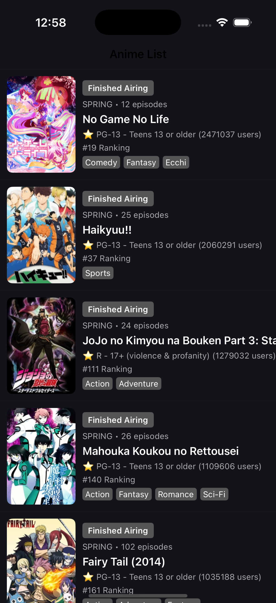

# Dashboard Textures

Simple iOS Anime List Dashboard implemented using AsyncDisplayKit and RxSwift, taking advantage of asynchronous UI plotting(rendering region values in background) and reactive programming

## Table of Contents

- [Previews](#previews)
- [Getting Started](#getting-started)
  - [Prerequisites](#prerequisites)
  - [Check it out yourself](#check-it-out-yourself)

## Previews



## Getting Started

Setting up your project locally.

### Prerequisites

- `XCode`
- `Swift`
- `SwiftUI`
- `Cocoapods`

### Dependencies

- `Alamofire`
- `RxSwift`
- `RxCocoa`
- `Textures`

### Check it out yourself

Step-by-step guide on how to install and set up the project.

1. Clone the repository:

   ```bash
   git clone https://github.com/Aakarsh-verma/DashboardTextures.git
   ```

2. Navigate to the project directory within terminal

   ```bash
   cd path/to/DashboardTextures
   ```

3. Install dependencies

   ```bash
   pod install
   ```

4. Open `DashboardTextures.xcworkspace` in **xcode** and run the project
